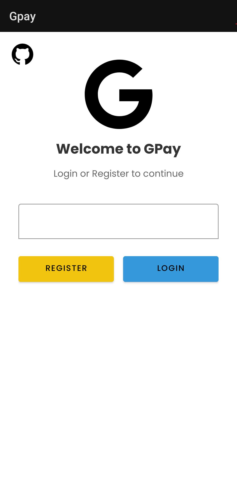
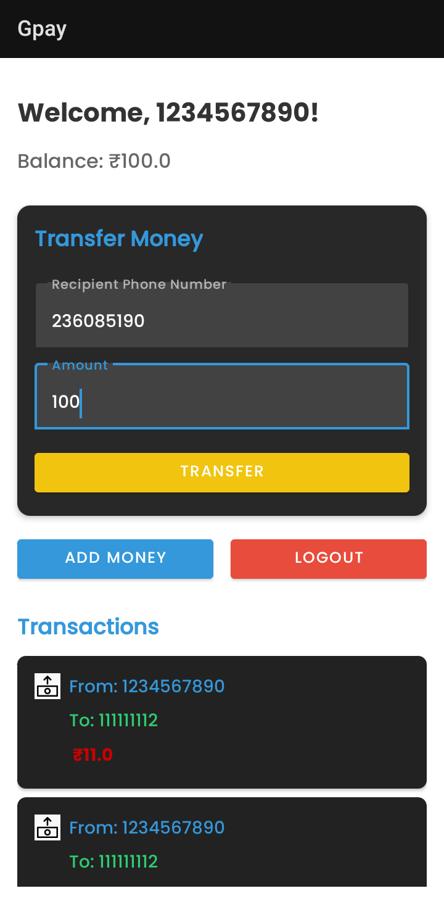

# GPay Clone App
https://ps-jpg.github.io/Gpay/

This repository contains a basic GPay clone app developed as part of an assessment. The app includes features like account sign-up, login, money transfer, and transaction history.

## Features
- **Account Signup:** Users can create a new account using their phone number or email.
- **Login:** Secure login with credentials.
- **Money Transfer:** Quickly transfer money to other users in the app.
- **Transaction History:** View all past transactions in a clean and organized manner.

## Screenshots

### Add Money System

### Login Screen

### Sign-Up Screen

### Transaction Success

## Demo Video
[Click here to watch the demo video](output/demo%20of%20gpay.mp4)

## Download the GPay APK

You can download the GPay APK from the following link:

[Download GPay APK](https://raw.githubusercontent.com/Ps-jpg/Gpay/master/output/gpay.apk)

